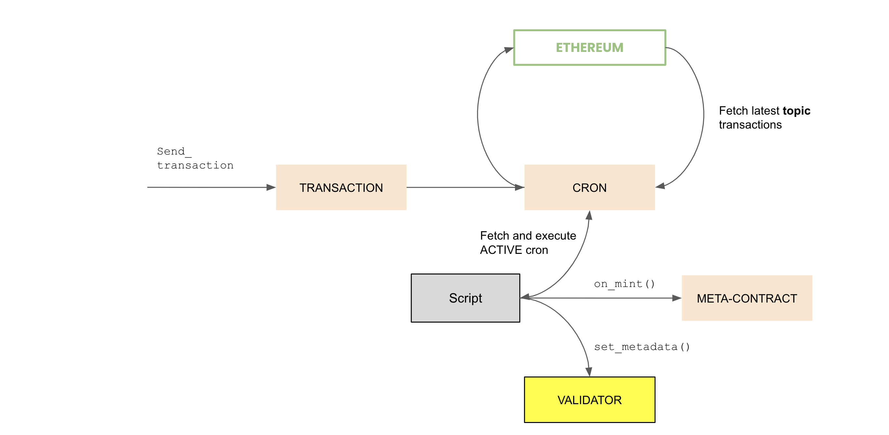

# Cron

An automated oracle scheduler that extracts information from the blockchain to initiate a process for a particular NFT, such as creating metadata for a newly minted NFT.

### Flow

### Benefit

1. Automation: Cron automates the process of executing specific actions at certain intervals without the need for manual intervention. This can save time and resources for the Lineage node operator.

2. Efficiency: By automating certain tasks, Cron can ensure that they are performed consistently and without delay, which can increase the efficiency of the system.

Scalability: As the number of NFTs and associated metadata grows, Cron can help ensure that the necessary tasks are performed in a timely and consistent manner, without requiring additional resources or manual intervention.

Flexibility: Cron can be configured to extract information from different sources and trigger different actions based on that information, providing flexibility and adaptability to the Lineage system.
