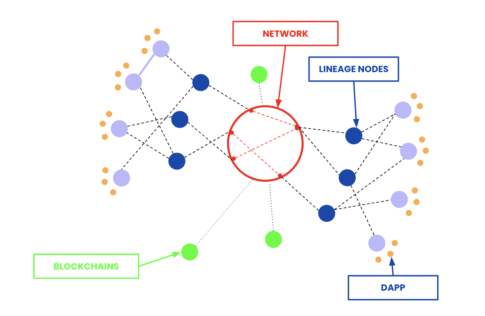

# What is Lineage Protocol?

Lineage Protocol is a permissionless metadata network for NFTs that allows for decentralized ownership of NFT metadata. It is built on top of IPFS with blockchain verifiable capability, and is designed to provide an open and democratic approach to the ownership and management of NFT metadata.

Using Lineage Protocol, NFT owners can manage and update their metadata in a decentralized and secure manner, without relying on a centralized platform. The metadata is stored as separate fields using different keys, and can be easily updated by the NFT owner using secp256k1 or ed2556 verification.

Lineage Protocol also includes features for access control and permissionless collaboration, allowing multiple users to collaborate on NFT metadata without affecting the original metadata.

Overall, Lineage Protocol offers a unique and innovative approach to NFT metadata management, providing increased security, decentralization, and transparency for NFT owners and users.

Fundamental Topic

- [Architecture](/Fundamental/architecture.md) - Technical overview
- [Transaction](/Fundamental/transaction.md) - Actions to manage or automate metadata execution
- [DataKey & TokenKey](/Fundamental/datakey.md) - NFT unique identifier using hash
- [IPFS Dag](/Fundamental/dag.md) - Data decentralised data storage using IPFS DAG
- [Fluence Network](/Fundamental/fluence-network.md) - Node computation capabilities using Fluence Network
- [Cron](/Fundamental/cron.md) - A schedular that automated the NFT metadata at every epoch.
- [Meta Contract](/Fundamental/meta-contract.md) - Wasm based smart contract for Lineage
